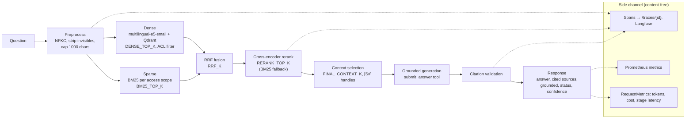

# EvalRAG

EvalRAG is a platform for building and **measuring** retrieval-augmented generation (RAG) systems. It runs the same question through three retrieval strategies (classic, graph, agentic) over one corpus. Every answer is grounded in citations that the server validates, and every run is scored with deterministic retrieval metrics and a versioned LLM judge. A regression gate compares each run with a baseline of the same configuration.

Stack: FastAPI backend (`backend/`), React + TypeScript frontend (`frontend/`), Qdrant, Postgres, Docker Compose (`infra/`), Anthropic Claude for generation and judging.

Further reading: [docs/CASE_STUDY.md](docs/CASE_STUDY.md) (engineering write-up), [LEARN.md](LEARN.md) (file-by-file walkthrough), [docs/ARCHITECTURE_AUDIT.md](docs/ARCHITECTURE_AUDIT.md) (the audit this version was built from).

---

## Problem

A RAG answer can fail at three independent points. Retrieval can miss the right passage. Generation can ignore or embellish what was retrieved. The citation can point at something that does not support the claim. A demo that "looks right" on a handful of questions does not show which of these happened, or whether a change to chunking, retrieval or prompts made things better or worse.

## Why RAG evaluation matters

- **Retrieval and generation fail differently.** Retrieval is scored here without any model call (Recall@K, nDCG@K...), so a retrieval change can be measured cheaply and separately from the generator.
- **Configurations drift.** An embedder swap or a silent reranker fallback changes results. Every run records a fingerprint of its retrieval configuration, and runs are only compared with runs that share it.
- **LLM judges are instruments.** Their scores are only meaningful for a given rubric version, and a judge that fails must not be counted as a low score. Both are enforced here (see [Evaluation methodology](#evaluation-methodology)).

---

## Architecture

Request pipeline, as implemented in [`retrieve.py`](backend/app/rag/retrieve.py), [`grounding.py`](backend/app/rag/grounding.py) and the strategies in [`backend/app/rag/strategies/`](backend/app/rag/strategies/). Stage names match the trace stages in [`tracing/stages.py`](backend/app/tracing/stages.py).



| Layer | Where |
|---|---|
| API routes (ask, compare, eval, ingest, graph, traces, advise, privacy, admin, metrics) | `backend/app/api/` |
| Parsing and chunking | `backend/app/rag/parsers/`, `backend/app/rag/chunking.py` |
| Retrieval (dense, BM25, fusion, rerank) | `backend/app/rag/retrieve.py`, `sparse.py`, `fusion.py`, `rerank.py` |
| Grounding and citation validation | `backend/app/rag/grounding.py` |
| Evaluation (metrics, judge, rubric, regression) | `backend/app/eval/` |
| Tracing, metrics, pricing | `backend/app/tracing/`, `backend/app/monitoring.py`, `backend/app/pricing.py` |
| Frontend pages: Ask (`/`), Upload (`/ingest`), Compare (`/compare`), Evaluation (`/eval`: Overview and Runs tabs), Advisor (`/advisor`) | `frontend/src/pages/` |

---

## Three retrieval strategies

All three return the same `StrategyResult` ([`base.py`](backend/app/rag/strategies/base.py)) and end with the same citation validation, so they can be compared on identical terms (`POST /compare/strategies`, `/compare` in the UI).

| Strategy | What it does | Model calls per question | Cost profile |
|---|---|---|---|
| **Classic** ([`classic.py`](backend/app/rag/strategies/classic.py)) | Hybrid retrieval → rerank → one grounded generation | 1 | Lowest. Can run on Anthropic, OpenAI or Ollama |
| **Graph** ([`graph.py`](backend/app/rag/strategies/graph.py)) | Extracts entities from the question, walks the knowledge graph 1 hop, merges those chunks with the fused hybrid candidates, reranks the union, and prepends a text subgraph to the context | 2 (entity extraction on `GRAPH_EXTRACTION_MODEL`, then generation) | Adds an offline build step: `POST /graph/build` runs one extraction call per chunk. The graph is **not** built at ingest |
| **Agentic** ([`agentic.py`](backend/app/rag/strategies/agentic.py)) | Claude drives `search` (fused hybrid results, not reranked, k ≤ 12), `fetch_chunk` and `finish` tools | Up to `AGENTIC_MAX_ITERS` (15) | Highest and variable. Anthropic only |

Entity linking in the graph is exact matching on normalised strings. The call counts above come from the code. No token or latency ratio between the strategies has been measured on the current pipeline (see [Current benchmark](#current-benchmark)).

The **Advisor** (`POST /advise`) ranks the strategies from a project description. Its scoring weights ([`advisor/scoring.py`](backend/app/advisor/scoring.py)) are still derived from the historical baseline below, so treat its ranking as a prior. `POST /advise/validate` measures the strategies on your own questions.

---

## Hybrid retrieval

`hybrid_search` ([`retrieve.py`](backend/app/rag/retrieve.py)) runs the dense and BM25 retrievers concurrently. It fuses them with Reciprocal Rank Fusion, `score(d) = Σ 1 / (k + rank_i(d))` ([`fusion.py`](backend/app/rag/fusion.py)), then reranks the fused pool with the cross-encoder.

| Setting | Default | Effect |
|---|---|---|
| `RETRIEVAL_MODE` | `hybrid` | `dense`, `sparse` (BM25 only) or `hybrid` |
| `DENSE_TOP_K` | `50` | Dense candidates (`RETRIEVAL_TOP_K` is a deprecated alias) |
| `BM25_TOP_K` | `50` | BM25 candidates |
| `RRF_K` | `60` | RRF constant |
| `RERANK_TOP_K` | `8` | Chunks kept by the reranker |
| `FINAL_CONTEXT_K` | `RERANK_TOP_K` | Chunks sent to the model; may not exceed `RERANK_TOP_K` |

- **BM25 index** ([`sparse.py`](backend/app/rag/sparse.py)). It is built in memory from the chunk payloads in Qdrant, with one model per access scope, so unreadable chunks never contribute candidates or term statistics. It is rebuilt in full when the collection's point count or the process's write generation changes. Tokens are lowercased, accent-folded, and French and English stopwords are removed.
- **Rerank pool.** The reranker receives `max(DENSE_TOP_K, BM25_TOP_K)` fused candidates, so hybrid mode costs the cross-encoder no more than dense-only.
- **Degradation.** If the BM25 index fails in hybrid mode, retrieval continues dense-only and records `"sparse"` in `degraded`. If the cross-encoder cannot load, reranking falls back to BM25, and the response reports `reranker: "bm25-fallback"` instead of hiding it.
- **Diagnostics in the API.** `/ask` and `/compare/strategies` return `retrieval`, which holds the mode, the reranker actually used, counts per stage (`dense`, `sparse`, `fused`, `reranked`, `final`), latency per stage, `degraded`, and, for each context chunk, its dense rank, sparse rank, fused score and rerank score.

## Chunking

`CHUNK_STRATEGY=structured` (default, [`chunking.py`](backend/app/rag/chunking.py)) cuts at headings first, including French legal divisions such as `Titre I`, `Chapitre 2` and `Article L. 121-1`. It then packs whole paragraphs. Only a paragraph larger than a chunk is split, between sentences, and only an over-long sentence is split between words. Overlap is made of whole trailing sentences. Markdown tables are split between rows, and each row group repeats the header. `fixed` keeps the legacy word windows for comparison.

- **Size.** `CHUNK_SIZE_TOKENS` (300) is counted in **words**. It is capped at `CHUNK_MAX_MODEL_TOKENS / 1.5` words, which is 341 words for the default 512-token window of the embedder and reranker. The cap is an estimate (1.5 subword tokens per word, `config.py:TOKENS_PER_WORD`), not a tokenizer count.
- **Metadata on every chunk** ([`ingest.py`](backend/app/rag/ingest.py)): `document_id`, `chunk_id`, `chunk_index`, `title`, `section`, `heading_path`, `page`/`page_end` (PDF and PPTX), `char_start`/`char_end`, `token_count`, plus `tenant`, `acl_groups`, `source_key`, `owner`, `ingested_at` and `pii_counts`. Citations use `title`, `section` and `page`.

## Grounding and citations

[`grounding.py`](backend/app/rag/grounding.py):

1. Each context chunk is shown to the model under a handle, `[S1]` … `[Sn]`, with a header such as `[S2] handbook.pdf | section: Leave | p. 12`. The model never sees raw chunk ids.
2. The model answers through a `submit_answer` tool (the agent uses `finish`, which has the same schema). The answer carries inline `[S#]` markers, `claims` (each with citations and a `supported` flag), `status` (`answered` | `partial` | `insufficient_context`) and `unsupported_notes`. Providers without tool use return the same object as JSON.
3. `validate_citations` is a pure function. It drops handles that are not in the context and strips their markers, listing them in `invalid_citations`. It builds `sources` from the **cited** chunks only, in citation order; the full context stays in `extra.context_sources`. The answer becomes the localised "cannot answer from the retrieved documents" refusal in three cases: the status is `insufficient_context`, the answer is empty, or no valid citation survives.
4. `grounded` is true only when all of these hold: status `answered`, at least one claim, every claim supported with a valid citation, and no invalid citation.
5. `confidence` is an **evidence score, not a calibrated probability**:

```
coverage  = supported claims citing >= 1 valid source / all claims
status    = 1.0 answered, 0.5 partial, 0 otherwise
relevance = mean cited-chunk retrieval score mapped to [0, 1] (logistic for logits)
base      = 0.5*coverage + 0.2*status + 0.3*relevance      (no scores: (0.5*coverage + 0.2*status) / 0.7)
score     = base * (1 - 0.5 * invalid / (invalid + valid)) ; a refusal scores 0
```

---

## Evaluation methodology

### Datasets

Documented in [data/golden/README.md](data/golden/README.md). The questions and labels were written by the project author.

| File | Questions | Language | Corpus | Notes |
|---|---:|---|---|---|
| `golden_v1` | 34 | English | `data/docs` | Frozen. One expected source per question (two have two) |
| `golden_v2` | 34 | English | `data/docs` | Frozen. v1's questions with every covering document; 2 refusal cases |
| `golden_fr_v1` | 16 | French | `data/docs` (English) | Frozen. Cross-lingual retrieval |
| `golden_v3` | 54 | English | `data/docs` | Categorised, with verbatim evidence quotes |
| `golden_fr_business_v1` | 37 | French | `data/demo_fr_business/docs` | Categorised, synthetic French business documents |

| Category | golden_v3 | golden_fr_business_v1 |
|---|---:|---:|
| single_hop / multi_hop / comparison / aggregation | 7 / 7 / 7 / 6 | 5 / 5 / 4 / 4 |
| ambiguous / unanswerable / citation_sensitive / adversarial | 6 / 7 / 7 / 7 | 4 / 5 / 5 / 5 |

`python scripts/run_eval.py --dry-run --all-datasets` validates every file offline ([`eval/dataset.py`](backend/app/eval/dataset.py)): JSON, schema, duplicate ids and questions, and that every referenced document exists in the dataset's own corpus (`data/golden/corpora.toml`). The verbatim evidence quotes were checked by a script when the sets were written; no check in the repository re-runs that.

### Metrics

- **Deterministic retrieval metrics** ([`eval/retrieval.py`](backend/app/eval/retrieval.py)), at document level with binary relevance: Recall@K, Precision@K (denominator K, trec_eval convention), HitRate@K, MRR and nDCG@K, at K = 1, 3, 5, 10 by default (`--k`). They are scored on each strategy's ranked context, so the agentic strategy's longer list is compared at the same K. Examples with no relevant documents are excluded and counted separately, not scored as zero.
- **LLM judge** ([`eval/judge.py`](backend/app/eval/judge.py), rubric in [`eval/rubric.py`](backend/app/eval/rubric.py)): faithfulness, answer relevance, context precision, context recall, and answer correctness when an ideal answer exists. The rubric is versioned (`RUBRIC_VERSION = "2026-09.v2"`), with anchors at 0 / 0.25 / 0.5 / 0.75 / 1, and each run records its version and fingerprint. The reply must validate against a Pydantic model: every score must be a float in [0, 1] (out-of-range values are rejected, not clamped), and every reasoning string must be non-empty. An invalid reply gets exactly one repair retry. The judge runs at temperature 0 where the model accepts it.
- **Failure accounting** ([`eval/metrics.py`](backend/app/eval/metrics.py)). Every example ends as `scored`, `judge_failed`, `generation_failed` or `not_judged`. Each aggregate reports `mean`/`std`/`n` over the examples where that metric was actually measured, and the run lists its `failures`. No score is invented for a failed judge call.
- **Refusal scoring.** Examples with `expected_behavior: "refuse"` (the unanswerable ones) are not judged. They are scored with `correct_refusal` (1 when the system declined). Answerable examples get `false_refusal`.
- Results are also broken down by `question_type` and `difficulty`, with p50/p95 latency, tokens per question and judge tokens.

## Regression testing

- **Thresholds** are set in [`eval/regression_thresholds.toml`](eval/regression_thresholds.toml): faithfulness, answer relevance, `recall@5` and MRR may drop by at most 0.03; `latency_p50_ms` may rise by at most 20%; `tokens_per_question` by at most 15%. A metric measured on fewer than `min_examples = 5` examples is `SKIPPED`, not passed.
- **Configuration fingerprint.** Runs are grouped by dataset, strategy, provider, model, prompt version, judge model, rubric version and `config_hash`. The hash covers the retrieval settings whose names start with `retrieval_`, `rerank_`, `bm25_`, `rrf_` or `chunk`, plus the embedding model, the reranker model and the retrieval mode the strategies reported ([`eval/metrics.py:retrieval_config`](backend/app/eval/metrics.py)).
- **Gate.** After each run, a regression report is saved next to it. The baseline is the pinned baseline for the configuration, or else the previous comparable run. `run_eval.py --fail-on-regression` exits with code 2 on any `FAIL`, and `--set-baseline` pins a run. `GET /eval/runs/{id}/regression` and the Runs tab of the Evaluation page serve the report.
- **Offline comparison** of two saved runs:

```bash
python scripts/regression_report.py BASELINE.json CURRENT.json --fail-on-regression
```

## Observability

- **Spans, in pipeline order** ([`tracing/stages.py`](backend/app/tracing/stages.py)): `preprocess → dense → sparse → fusion → rerank → context_selection → generation → citation_validation → response`. Graph adds `entity_extraction` and `graph_walk` before them; agentic runs repeat stages for each step. `GET /traces/{id}` returns them as `stages`. Traces are kept in memory (1,000 most recent) and are lost on restart.
- **Langfuse, self-hosted.** `--profile tracing` runs Langfuse v4 in the Compose stack. Export is off by default (`TELEMETRY_MODE=off`). In `self_hosted` mode it goes only to hosts in `TELEMETRY_ALLOWED_HOSTS`. Spans are tagged `evalrag.stage`, and generation spans carry `usage_details` and `cost_details`. All providers (Anthropic, OpenAI, Ollama) produce generation spans.
- **Prometheus** (`METRICS_ENABLED=true`, [`monitoring.py`](backend/app/monitoring.py)): HTTP requests and latency, `evalrag_strategy_duration_seconds`, `evalrag_stage_duration_seconds`, `evalrag_llm_tokens_total`, `evalrag_llm_cost_usd_total`, `evalrag_llm_unpriced_calls_total`, `evalrag_request_cost_usd`, `evalrag_context_chunks`, refusals, circuit-breaker state and telemetry export and drop counters.
- **Never recorded:**
  - Stage attributes, span metadata and structured logs never contain chunk or question text; `backend/tests/test_request_metrics.py` checks this.
  - Metrics carry no content and no identifiers.
  - API keys, user identifiers and IP addresses are never exported.
  - Question and answer text reaches Langfuse only when `TELEMETRY_INCLUDE_CONTENT=true` (the default), and only after PII redaction; set it to `false` to export timings and counts only.
  - The audit log stores a SHA-256 hash of each question unless `AUDIT_STORE_QUESTIONS=true`.

Details: [docs/monitoring.md](docs/monitoring.md).

## Cost and latency measurement

- **`RequestMetrics`** ([`rag/request_metrics.py`](backend/app/rag/request_metrics.py)) is returned on every `/ask` answer and every `/compare/strategies` row. It holds input and output tokens, `estimated_cost_usd`, `llm_calls`, `retrieved_chunks`, `context_chunks`, and `latency_ms` split into `retrieval`, `rerank`, `generation`, `citation_validation` and `other`, which add up to `total`.
- **Prices** come from [`config/model_pricing.toml`](config/model_pricing.toml): Anthropic list prices in USD per million tokens, with source "Anthropic Claude API list prices", `as_of = "2026-09-25"`, checked 2026-09-29. Each call is priced with the model that served it. A call to an unlisted model (for example an OpenAI or Ollama model) makes the request's cost `null`, never an estimate. Set `MODEL_PRICING_PATH` to use a different table.
- **Evaluation page, Overview tab** (`/eval`) plots recorded eval runs as quality against cost and latency, by strategy, with the regression status of each configuration.

## French business-document demo

[data/demo_fr_business/](data/demo_fr_business/README.md) holds 13 **synthetic, fictional** French business documents: terms of sale, a supplier contract, quotes, a purchase order, a delivery note, invoices, a penalty notice, certificates and a CSV invoice register. The amounts are internally consistent, the identifiers are deliberately invalid, and the documents contain deliberate contract-versus-terms conflicts. `golden_fr_business_v1` (37 questions) evaluates multi-hop chains over them, such as quote → order → delivery → invoice → penalty. The corpus is ingested into its own collection; see that README.

---

## Current benchmark

**Measured:** BM25 (sparse) first-stage retrieval, reranking off. Produced by `scripts/benchmark_retrieval.py` on 2026-09-29 from commit `885f3fd` ([data/benchmarks/](data/benchmarks/README.md)). Corpus `data/docs`: 41 documents, 467 chunks. `golden_fr_business_v1` uses its own corpus: 13 documents, 43 chunks. Unanswerable questions are excluded from the retrieval metrics.

| Dataset (questions scored) | K | Recall@K | Precision@K | HitRate@K | MRR | nDCG@K |
|---|---:|---:|---:|---:|---:|---:|
| golden_v1 (34/34) | 5 | 0.529 | 0.132 | 0.529 | 0.422 | 0.449 |
| golden_v1 | 10 | 0.647 | 0.092 | 0.647 | 0.439 | 0.489 |
| golden_v2 (32/34) | 5 | 0.669 | 0.384 | 0.875 | 0.724 | 0.636 |
| golden_v2 | 10 | 0.815 | 0.280 | 0.938 | 0.735 | 0.704 |
| golden_fr_v1 (16/16) | 5 | 0.760 | 0.419 | 0.875 | 0.750 | 0.700 |
| golden_fr_v1 | 10 | 0.844 | 0.311 | 0.875 | 0.750 | 0.745 |
| golden_v3 (47/54) | 5 | 0.938 | 0.402 | 1.000 | 0.888 | 0.877 |
| golden_v3 | 10 | 0.968 | 0.238 | 1.000 | 0.888 | 0.891 |
| golden_fr_business_v1 (32/37) | 5 | 0.867 | 0.340 | 0.906 | 0.708 | 0.739 |
| golden_fr_business_v1 | 10 | 0.940 | 0.220 | 0.969 | 0.717 | 0.766 |

K = 1 and K = 3 are in the per-dataset files. How to read these numbers:

- **Environment.** The benchmark environment had no access to Hugging Face, so the embedding model could not be loaded. Dense and hybrid modes were **skipped** and are listed as such in each file. No dense or hybrid number exists in this repository.
- **Optimism.** `golden_v3` and `golden_fr_business_v1` were written by reading the source documents, so their questions share vocabulary with the relevant passages. BM25 is favoured on them, and their numbers are not evidence that lexical retrieval is sufficient.
- **`golden_v1` labels.** They reference only 6 of the 41 documents, because the set was labelled when the corpus had 6. Documents added later on the same topics (for example `reranking_deep_dive.md` next to `reranking.md`) are not labelled relevant, so retrieving them counts as a miss.
- **Definitions in the benchmark script.** K counts **chunks**: the documents behind the top K chunks are deduplicated and scored. Precision is the share of those distinct documents that are relevant, and MRR is computed within the top K. These differ from the eval harness's document-level @K metrics described above, so compare benchmark files only with each other.

### Not yet measured

The following have **not** been measured on the current pipeline, because no Anthropic API key and no Hugging Face access were available: dense and hybrid retrieval, reranking gains, all generation metrics (faithfulness, relevance, correctness, refusal accuracy), and per-request cost and latency. To produce them:

```bash
python scripts/download_models.py --cache-dir .hf_cache            # embedder + reranker
PYTHONPATH=backend python scripts/benchmark_retrieval.py --dataset golden_v3              # dense, sparse, hybrid
PYTHONPATH=backend python scripts/benchmark_retrieval.py --dataset golden_v3 --rerank     # with the reranker
# Needs ANTHROPIC_API_KEY and an ingested corpus (step 5 of the quickstart):
python scripts/run_eval.py --dataset golden_v3 --all                # every strategy, judge included
python scripts/run_eval.py --dataset golden_v3 --all --no-judge     # retrieval + refusal metrics only
```

### Historical baseline (previous pipeline, not re-run)

This table was produced at commit `2175ce8` by a pipeline that no longer exists: the `BAAI/bge-small-en-v1.5` embedder, the English `ms-marco-MiniLM-L-6-v2` reranker, word-window chunks, an English-only prompt, dense-only retrieval and no citation validation. The corpus was 41 documents and 107 chunks, with `golden_v1` (34 questions). It is kept for history only and is **not** a result of the current system.

| Metric | Classic | Graph | Agentic |
|---|---|---|---|
| Retrieval recall / MRR | 0.765 / 0.554 | 0.765 / 0.554 | 0.544 / 0.356 |
| Faithfulness | 0.507 | 0.519 | 0.249 |
| Answer relevance | 0.862 | 0.854 | 0.521 |
| Tokens (total) | 389,251 | 397,431 | 727,101 |
| Refusals | 0 | 0 | 6 |

---

## Reproducibility

### Docker quickstart

The Compose file is `infra/docker-compose.yml`, and Compose only auto-loads a `.env` placed next to it. Run every command from the project root with `--env-file .env`; without it, Compose stops with `required variable POSTGRES_PASSWORD is missing a value`.

```bash
cp .env.example .env          # Windows: copy .env.example .env
# set ANTHROPIC_API_KEY and POSTGRES_PASSWORD in .env
pip install huggingface_hub && python scripts/download_models.py --cache-dir .hf_cache   # optional, recommended
docker compose --env-file .env -f infra/docker-compose.yml up -d --build
docker compose --env-file .env -f infra/docker-compose.yml exec backend python /scripts/ingest.py
docker compose --env-file .env -f infra/docker-compose.yml exec backend python /scripts/run_eval.py --dataset golden_v3
```

- **Models.** The embedder and reranker download on first use into `.hf_cache/`, which is bind-mounted. Set `HF_HUB_OFFLINE=1` and `TRANSFORMERS_OFFLINE=1` in `.env` only after they are downloaded.
- **Profiles.** Add `--profile tracing` (Langfuse; set its secrets first) or `--profile monitoring` (Prometheus and Grafana).
- **Ports.** Every port is published on **127.0.0.1 only**. Frontend <http://localhost:5173>, API docs <http://localhost:8011/docs>, Langfuse `:3100`, Prometheus `:9090`, Grafana `:3300`, Postgres `:5434`, Qdrant `:6333`.
- **Default corpus.** `scripts/ingest.py` ingests `data/docs` only, the corpus the golden datasets are labelled against. `--with-meta` also adds the top-level `README.md`, `EvalRAG.md` and `LEARN.md`.
- **Stop.** `docker compose --env-file .env -f infra/docker-compose.yml down` stops the stack; add `-v` to also wipe the volumes.

### Evaluation and benchmark commands

```bash
python scripts/run_eval.py --dry-run --all-datasets                       # validate datasets, no model calls
python scripts/measure_retrieval.py --dataset golden_v3 --show-misses     # dense + rerank on the live index, no LLM
PYTHONPATH=backend python scripts/benchmark_retrieval.py --modes sparse --dataset golden_v3   # in-process, no Docker
python scripts/run_eval.py --dataset golden_v3 --all --fail-on-regression
```

## Tests

```bash
cd backend && python -m pytest -q --cov=app          # 1,495 tests, 95% line coverage
ruff check app tests ../scripts && mypy app
cd ../frontend && npm ci && npm run lint && npm run typecheck && npm test && npm run build   # 102 Vitest tests
```

CI ([`.github/workflows/ci.yml`](.github/workflows/ci.yml)) runs ruff, mypy (app and scripts), pytest with `--cov-fail-under=90`, the frontend lint, typecheck, tests and build, `docker compose config`, image builds, and dependency audits. Qdrant, the embedding model and the cross-encoder are mocked or run in process in the tests. CI does **not** run any evaluation against a model.

---

## Limitations

- **The judge is not calibrated against human labels.** Human ratings can be recorded (`POST /eval/human-rate`), but agreement with the judge is not computed.
- **Small corpora, self-authored datasets.** 41 English documents and 13 French ones; 175 questions in total, all written by the project author. The two newest sets share vocabulary with their sources.
- **Only BM25 retrieval has current numbers.** Dense, hybrid, reranking and generation have not been measured on this pipeline (see above).
- **The strategies were compared on one small corpus**, and only in the historical baseline. The Advisor's weights still come from it.
- **BM25 index:** held in memory per process and per access scope, and rebuilt in full whenever the collection changes. It does not scale to large corpora, and each worker holds its own copy.
- **Config fingerprint gaps.** `DENSE_TOP_K` and `FINAL_CONTEXT_K` fall outside the name prefixes the hash covers. Two runs that differ only in those settings are grouped as comparable.
- **Access scoping gaps.** `GET /traces/{id}` and `/eval/runs` require authentication but are not scoped by tenant or principal. OIDC users are not rate-limited or metered, because they have no key row.
- **Grafana.** The provisioned dashboard has no panels for the cost, stage-latency and context-size metrics.
- **Graph strategy.** Entity linking is exact string matching, the graph is a JSONL file with an in-process index, and it must be rebuilt with `POST /graph/build` after ingestion.
- **Chunk cap.** The 512-token cap relies on a words-to-tokens ratio of 1.5, not on the tokenizer.
- **`scripts/measure_retrieval.py` is dense-only.** It calls `dense_search` and the reranker directly and ignores `RETRIEVAL_MODE`; use `benchmark_retrieval.py` to compare modes.

---

## Enterprise and EU features

- **Languages.** The embedder (`intfloat/multilingual-e5-small`) and reranker (`cross-encoder/mmarco-mMiniLMv2-L12-H384-v1`) are multilingual. Answers come back in the language of the question, and the UI has a FR/EN switch. The embedding model is stamped on the Qdrant collection, and a mismatch returns 503 `embedding_model_mismatch`.
- **Access control.** API keys or OIDC SSO (Entra ID, ProConnect, Keycloak) with `REQUIRE_API_KEY=true`. Each chunk carries a `tenant` and `acl_groups`, filtered inside Qdrant and re-checked in Python. The BM25 index is built per scope, and the graph walk is restricted to readable documents. An audit log is kept in Postgres. Keys: `python scripts/setup_auth.py --create-key NAME --groups legal --tenant acme`.
- **GDPR.** PII masking at ingest (`PII_MODE_INGEST`: e-mail, French phone numbers, NIR, IBAN, SIREN/SIRET, cards, IPv4); redaction in logs and traces; erasure, subject-access export and retention endpoints under `/privacy`. See [docs/gdpr/README.md](docs/gdpr/README.md) and the CNIL-style register template [docs/gdpr/ropa_template.md](docs/gdpr/ropa_template.md). Neither is legal advice.
- **Telemetry that stays local.** Off by default, with self-hosted Langfuse and Prometheus; see [docs/monitoring.md](docs/monitoring.md).
- **Formats.** `.pdf` (with OCR for scanned pages), `.docx`, `.pptx`, `.odt`, `.ods`, `.eml`, `.html`, `.txt`, `.md`, `.rst`, `.csv` and `.json`, with zip-bomb and encrypted-file guards. `GET /ingest/formats` lists them.

## Configuration

[`.env.example`](.env.example) documents every setting. Defaults below are from [`backend/app/config.py`](backend/app/config.py).

| Setting | Default | Effect |
|---|---|---|
| `GENERATOR_PROVIDER` / `GENERATOR_MODEL` | `anthropic` / `claude-sonnet-5` | Answer generation |
| `JUDGE_MODEL` | `claude-opus-5-5` | LLM judge |
| `GRAPH_EXTRACTION_MODEL` | `claude-haiku-4-5-20251001` | Graph triples and question entities |
| `AGENTIC_MODEL` / `AGENTIC_MAX_ITERS` | `claude-sonnet-5` / `15` | Agentic strategy |
| `RETRIEVAL_MODE`, `DENSE_TOP_K`, `BM25_TOP_K`, `RRF_K` | `hybrid`, `50`, `50`, `60` | See [Hybrid retrieval](#hybrid-retrieval) |
| `RERANK_TOP_K` / `FINAL_CONTEXT_K` | `8` / `RERANK_TOP_K` | Reranked chunks / chunks sent to the model |
| `CHUNK_STRATEGY` / `CHUNK_SIZE_TOKENS` / `CHUNK_OVERLAP_TOKENS` | `structured` / `300` / `50` | Chunking, in words; applies to new ingests |
| `CHUNK_MAX_MODEL_TOKENS` | `512` | Caps chunk size at this / 1.5 words (0 disables) |
| `EMBEDDING_MODEL` | `intfloat/multilingual-e5-small` | Changing it requires a re-ingest |
| `RERANKER_MODEL` | `cross-encoder/mmarco-mMiniLMv2-L12-H384-v1` | Cross-encoder |
| `MAX_UPLOAD_MB` | `25` | Upload ceiling |
| `REQUIRE_API_KEY` / `OIDC_ISSUER` | `false` / empty | Authentication |
| `PII_MODE_INGEST` | `mask` | `off`, `mask` or `reject` |
| `RETENTION_TRACES_DAYS` | `7` | `0` keeps forever |
| `TELEMETRY_MODE` / `METRICS_ENABLED` | `off` / `false` | Telemetry export / `/metrics` |
| `OCR_ENABLED` / `OCR_LANGUAGES` | `true` / `fra+eng` | OCR for scanned PDFs |

## Development

```bash
cd backend && python -m venv .venv && . .venv/bin/activate
pip install --index-url https://download.pytorch.org/whl/cpu torch && pip install -e ".[dev]"
cd ../frontend && npm ci && npm run dev    # Node 22.12 or newer
```

The app imports without any configuration: `settings.validate_startup()` runs in the FastAPI lifespan, not at import time. More detail: [backend/SETUP.md](backend/SETUP.md).

## Troubleshooting

- **The backend exits at startup with `GENERATOR_PROVIDER is 'anthropic' but ANTHROPIC_API_KEY is not set`.** Set the key in `.env`, or use `GENERATOR_PROVIDER=local` with Ollama. The graph and agentic strategies, the judge and graph extraction still need Anthropic.
- **`required variable POSTGRES_PASSWORD is missing a value`.** Add `--env-file .env` to the Compose command.
- **`reranker: "bm25-fallback"` in the `retrieval` diagnostics.** The cross-encoder did not load. Download the models, or check `.hf_cache/`.
- **503 `embedding_model_mismatch`.** The collection was built with another embedder. Re-ingest into a new `QDRANT_COLLECTION`, or wipe with `down -v`.
- **401 on every request** means `REQUIRE_API_KEY=true` with no key sent. **429** means the key's per-minute limit (`--rpm`, default 10) was reached.
- **The graph strategy returns nothing.** Run `POST /graph/build` (admin key), then poll `GET /graph/build/{job_id}`.

## License

[MIT](LICENSE)
