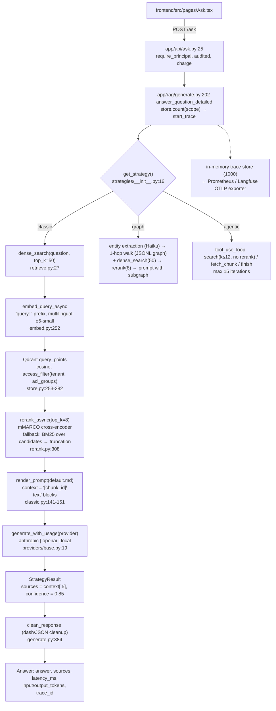

# EvalRAG architecture audit (Phase 1)

> Pre-upgrade audit (commit 054a182); see the [README](../README.md) for the current state.

- **Scope:** `backend/app/`, `frontend/src/`, `data/golden/`, `scripts/`, `infra/`, `README.md`, `EvalRAG.md`, `LEARN.md`, `docs/`.
- **Audited revision:** `054a182`.
- **Method:** every claim below was checked against the source. Citations are `path:line` relative to the repository root, with `backend/app/` shortened to `app/`.
- **Scope of change:** no code was modified. This file is the only addition.

---

## 1. Summary

EvalRAG is a working, well-tested RAG comparison bench. It has three strategies (classic, graph, agentic) behind one `StrategyResult` contract. It also has an LLM-as-judge harness, a set of deterministic document-level retrieval metrics, ACL-filtered Qdrant retrieval, GDPR tooling, and OTLP/Langfuse and Prometheus telemetry. The backend suite passes: 928 tests at 92% line coverage.

The main gaps are in how rigorous the measurement is and in how well the docs match the code:

- **Retrieval is dense-only.** BM25 is used only as a fallback scorer inside the reranker, over the dense candidates (`app/rag/rerank.py:180-243`). There is no hybrid retrieval.
- **Citations are not validated.** The model is asked to cite `[chunk_id]` (`app/prompts/default.md:16`). Nothing checks those ids against the context: `extract_citations` exists but only the tests call it. For classic and graph, the returned `sources` are the first five reranked chunks, not the chunks the model cited (`app/rag/strategies/classic.py:182-189`).
- **Retrieval metrics are coarse.** They are computed per document, at a single cutoff: precision, recall, hit rate and MRR. There is no nDCG, no @k variants, no chunk-level relevance, and no separate numbers for before and after reranking (`app/eval/retrieval.py:65-133`).
- **Regression detection is narrow.** It compares only the five judge dimensions between consecutive runs, using a fixed absolute threshold. The config key leaves out the embedding model, the reranker and the chunking settings. Retrieval metrics are never compared (`app/eval/regression.py:98-160`).
- **The README baseline is stale.** It was produced at commit `2175ce8` with `BAAI/bge-small-en-v1.5`, the English `ms-marco-MiniLM-L-6-v2` reranker, plain word-window chunking and judge `claude-opus-5`. Every one of those has since changed. The advisor's scoring weights are derived from that table.
- **`confidence` is a constant.** It is a hard-coded value (0.85 by default, 0.9 or 0.6 for agentic), not a measurement (`app/rag/strategies/base.py:61`, `app/rag/strategies/agentic.py:405`).

---

## 2. Current architecture

### 2.1 Request path (`POST /ask`, classic strategy)



### 2.2 Components

| Layer | Implementation | Key files |
|---|---|---|
| API | FastAPI routers for ask, compare, eval, ingest, graph, traces, advise, privacy, admin and metrics | `app/main.py:97-106` |
| Strategies | `ClassicRAG`, `GraphRAG`, `AgenticRAG` sharing `StrategyResult` | `app/rag/strategies/` |
| Parsing | Per-format parsers (pdf+OCR, docx, pptx, odt/ods, eml, html, text), zip-bomb guard | `app/rag/parsers/` |
| Chunking | Heading-aware, table-row-preserving, word-based | `app/rag/chunking.py:73-102` |
| Embedding | SentenceTransformers, family-aware prefixes, normalised | `app/rag/embed.py` |
| Vector store | Qdrant, one unnamed dense vector per chunk, COSINE, ACL payload indexes | `app/rag/store.py:92-160` |
| Rerank | Cross-encoder, then BM25, then truncation | `app/rag/rerank.py` |
| Generation | Anthropic (instrumented), OpenAI and Ollama (classic only) | `app/rag/providers/` |
| Graph | Triples extracted by Claude Haiku, stored in JSONL with an in-process index | `app/rag/graph_extract.py`, `app/rag/graph_store.py` |
| Eval | LLM judge, doc-level retrieval metrics, file-based runs, regression scan | `app/eval/` |
| Access | Tenant + group ACL on each chunk, OIDC/API-key principals | `app/access.py`, `app/auth.py`, `app/oidc.py` |
| Observability | Contextvar spans, OTLP JSON to Langfuse, Prometheus registry, optional W&B | `app/tracing/`, `app/monitoring.py` |
| Infra | Compose: qdrant, postgres, backend, frontend; profiles `tracing` (Langfuse v4 stack) and `monitoring` (Prometheus, Grafana) | `infra/docker-compose.yml` |

---

## 3. Detailed findings (questions 1 to 15)

### 3.1 What is actually implemented

- **Three strategies:**
  - Classic (`app/rag/strategies/classic.py:65-207`).
  - Graph (`app/rag/strategies/graph.py`).
  - Agentic, a tool-use loop with `search`, `fetch_chunk` and `finish` (`app/rag/strategies/agentic.py:217-372`).
- **Strategy comparison endpoints:** `/compare` and `/compare/strategies` (`app/api/compare.py:38-177`).
- **Ingestion:** parse, then PII mask, then heading-aware chunking, then embedding, then upsert. Stale revisions are deleted afterwards (`app/rag/ingest.py:90-189`).
- **Embedding-model stamp:** the model is recorded on the Qdrant collection. A mismatch is refused (`app/rag/collection_model.py:1-40`, `app/rag/store.py:100-133`).
- **ACL filtering in Qdrant on every read path, with a Python re-check:** `app/rag/store.py:165-191`.
- **LLM judge:** four required dimensions plus an optional `answer_correctness` (`app/eval/judge.py`).
- **Deterministic document-level retrieval metrics:** `app/eval/retrieval.py`.
- **A free retrieval-only measurement script:** `scripts/measure_retrieval.py`.
- **Regression scan over saved runs:** `app/eval/regression.py`.
- **Human ratings, stored as JSONL:** `app/eval/human_ratings.py`. They are not used for judge calibration.
- **Telemetry:**
  - Traces with `retriever`, `rerank`, `generation` and `tool` spans (`app/tracing/instrument.py:38-106`).
  - An OTLP exporter to Langfuse (`app/tracing/langfuse_exporter.py`).
  - Prometheus metrics (`app/monitoring.py:33-76`).
  - A telemetry egress policy (`app/tracing/policy.py`).
- **GDPR:** PII detection and masking, erasure, export and retention (`app/privacy/`).
- **Advisor:** a deterministic strategy recommender (`app/advisor/`).
- **Frontend pages:** Ask, Ingest, Compare, Data, Eval, Regressions and Advisor (`frontend/src/main.tsx:155-161`).
- **CI:** ruff, mypy, pytest with coverage (no threshold), frontend lint, typecheck, tests and build, a compose config check and image builds (`.github/workflows/ci.yml`). There is no eval or retrieval quality gate.

### 3.2 What is only described in documentation

`EvalRAG.md:37` states that the file is a blueprint. The items below are nonetheless presented as design features and have no backing in the code:

| Doc claim | Location | Code reality |
|---|---|---|
| BM25 / sparse index as a retrieval component | `EvalRAG.md:77-79` (diagram) | No sparse index. BM25 is built per query over the dense candidates (`app/rag/rerank.py:206-209`). |
| SSE between frontend and API | `EvalRAG.md:70` | JSON only. `EvalRAG.md:257` itself says there is no streaming. |
| Document store in Postgres + S3; eval store in Postgres | `EvalRAG.md:86, 177-179` | Chunks live only in the Qdrant payload. Eval runs are JSON files in `data/eval_runs` (`app/eval/metrics.py:35, 350-366`). |
| `Chunk.embedding` field | `EvalRAG.md:190` | Absent (`app/schemas/__init__.py:179-214`). |
| Embedding model stored with each vector; payload filters on `doc_id`, `tags`, `date` | `EvalRAG.md:213-214` | The model is stamped on the collection, not on each vector. The only payload indexes are `tenant` and `acl_groups` (`app/rag/store.py:138`). |
| Embeddings `text-embedding-3-large` / `bge-large-en`; reranker `bge-reranker-large` / Cohere | `EvalRAG.md:101-102` | `intfloat/multilingual-e5-small` and `cross-encoder/mmarco-mMiniLMv2-L12-H384-v1` (`app/config.py:196, 219`). |
| Query rewrite, multi-query, HyDE | `EvalRAG.md:53, 223, 234-240` | Not implemented. No match for hyde, rewrite or multi_query in `app/`. |
| Context compression | `EvalRAG.md:226, 247` | Not implemented. |
| Structured output with retry, rejection of answers without citations | `EvalRAG.md:228-229, 279-281` | Free-text answers. No citation check, no retry. |
| Anthropic prompt caching | `EvalRAG.md:256` | No `cache_control` anywhere in `app/`. |
| Every call traces cost | `EvalRAG.md:258, 378` | Token counts only. No currency cost is computed (`app/tracing/langfuse_exporter.py:128-137`). |
| Judge calibration (Cohen's kappa), few-shot rubrics, pairwise, order randomisation | `EvalRAG.md:303-305` | Zero-shot rubric, single pass, no calibration (`app/eval/judge.py:57-103`). |
| 100-500 golden examples, stratified by difficulty and failure mode | `EvalRAG.md:311-312` | 34 + 34 + 16 examples with document-level labels only (`data/golden/*.jsonl`). |
| Regression CI: per-example diff, PR comment, `--baseline main` | `EvalRAG.md:320-339` | No eval step in `.github/workflows/ci.yml`. `run_eval.py` has no `--baseline` flag. No `post_pr_comment.py` exists. |
| Traces page in the UI | `EvalRAG.md:369` | No such page (`frontend/src/main.tsx:155-161`). |
| Rerank scores and retrieved chunk scores in traces | `EvalRAG.md:378` | Scores are discarded. Rerank spans record ids and counts only (`app/tracing/instrument.py:31-35`). |
| Toxicity / jailbreak output filter | `EvalRAG.md:388` | Not implemented. |
| RRF unit tests, load tests, OpenAPI-generated client | `EvalRAG.md:396-400` | None present. |
| Alembic migrations | `EvalRAG.md:409` | Not a dependency. |
| "Every section above maps to a concrete module" | `EvalRAG.md:452` | False for sections K, L, N, P (calibration), Q, R (CI), T (Traces), U (cost) and V (output filter). |

### 3.3 Current retrieval pipeline, step by step

The pipeline below is the classic strategy (`app/rag/strategies/classic.py`).

1. **Document gate.** `store.count(access)` is called. If it returns 0, the answer is a refusal (`app/rag/generate.py:231-248`).
2. **Candidate retrieval.** `dense_search(question, top_k=settings.retrieval_top_k)` (`classic.py:102`, default 50 at `app/config.py:267`):
   - The query is embedded with the `query: ` prefix (`app/rag/embed.py:252-270`).
   - Qdrant `query_points` runs with `access_filter` as `query_filter`, and every hit is re-checked in Python (`app/rag/store.py:265-276`).
   - Chunks are rebuilt from the payload. The Qdrant similarity score is dropped, and `tokens` holds a whitespace word count (`app/rag/retrieve.py:64-75`).
3. **Reranking.** `rerank_async(question, candidates, top_k=8)` runs in a two-thread executor (`app/rag/rerank.py:56, 308-325`). Cross-encoder scores are used only for sorting and then discarded (`rerank.py:152-156`).
4. **Empty-context refusal.** An empty context produces a refusal with the placeholder `Source(chunk_id="none")` (`classic.py:124-139`). No relevance threshold exists: low-scoring chunks are always passed on.
5. **Context formatting.** Each chunk is written as `[chunk_id]\n<text>` (`classic.py:141`). The text goes into `default.md` and is sent as one user message, with no system prompt (`classic.py:151`, `app/rag/providers/anthropic_provider.py:223-230`).
6. **Generation.** The call goes through the provider dispatcher (`classic.py:163-165`).
7. **Sources.** The first five of the eight context chunks become `sources`, each with a 280-character quote. `extra` stores `retrieved_ids`, `retrieved_docs` and `context_text` for the eval (`classic.py:180-206`).

The other strategies differ as follows:

- **Graph.** Graph triples must first be built with `POST /graph/build`. The strategy then:
  - extracts entities with Haiku;
  - walks 1 hop by exact lower-cased string match (`app/rag/graph_store.py:56-57, 224-253`), restricted to `readable_doc_ids(access)`, which scrolls every readable chunk per query (`app/rag/store.py:419-431`);
  - fetches the graph-only chunks, runs the same 50-candidate dense search, and reranks the union to 8;
  - prepends a text subgraph to the context (`app/rag/strategies/graph.py:218-330`).
- **Agentic.** The model issues its own `search` calls: dense only, k clamped to 1-12, 300-character previews, no rerank (`app/rag/strategies/agentic.py:50, 217-262`).

### 3.4 Embedding model

- **Default model:** `intfloat/multilingual-e5-small`, 384 dimensions (`app/config.py:191-199`). Vectors are L2-normalised (`app/rag/embed.py:180, 218`) and stored with COSINE distance (`app/rag/store.py:120`).
- **How prefixes are chosen:**
  - `embedding_profile()` matches the last path segment of the model id against `_PROFILES` (`app/rag/embed.py:61-77, 80-105`):
    - `multilingual-e5-*` gets `query: ` / `passage: `;
    - `e5-*instruct` gets an instruction-style query prefix only;
    - `bge-m3` and `bge-*-en` get none.
  - `EMBEDDING_QUERY_PREFIX` / `EMBEDDING_PASSAGE_PREFIX` override the chosen prefixes when set, and `''` disables them (`embed.py:96-105`, `app/config.py:200-213`).
- **Where prefixes are applied:** `prepare_texts` adds the prefix based on `kind` (`embed.py:113-119`). Ingestion uses the default `kind="passage"` (`app/rag/ingest.py:161`). Queries use `kind="query"` (`embed.py:270`).
- **Collection stamp:** the model id and dimension are stamped on the collection (`app/rag/collection_model.py:28-30`). A mismatch raises `EmbeddingModelMismatch`, which is served as a 503.
- **Risk: silent truncation.** Chunks default to 600 words (`app/config.py:261-262`), which is typically well over the 512-token maximum input of E5-small and of the MiniLM cross-encoder. The tail of long chunks is therefore likely truncated at both embedding and rerank time. Nothing measures or warns about this.

### 3.5 Reranker and fallback

- **Default model:** `cross-encoder/mmarco-mMiniLMv2-L12-H384-v1`, a multilingual 12-layer model (`app/config.py:214-223`). It is loaded lazily (`app/rag/rerank.py:93`).
- **Fallback chain:**
  1. If the cross-encoder cannot load, or `predict` raises, BM25 is used instead (`rerank.py:139-140, 170-177`).
  2. If BM25 raises, the candidates are truncated in their input order (`rerank.py:232-243`).
- **Retry after a load failure:** a failed load is retried after a 300-second cooldown (`rerank.py:64, 83-87`).
- **Small candidate sets:** when there are no more candidates than `top_k`, the set is reordered and returned in full (`rerank.py:278-301`).
- **The fallback is invisible outside the logs.** It appears only in log lines (`"reranker": "bm25"`, `rerank.py:227`). It is not a span attribute, not a Prometheus metric and not an `Answer` field, so an evaluation run cannot tell which reranker produced its numbers. The README warns about this at `README.md:44`.

### 3.6 Is BM25 true hybrid retrieval? No.

BM25 is only a reranker fallback. The module docstring says so directly:

```python
# app/rag/retrieve.py:7-10
Retrieval is dense-only: the query is embedded and matched against the vector
store. The lexical (BM25) signal enters later, in `rerank.py`, as the reranker's
fallback scorer -- so this is a dense-retrieve/rerank pipeline, not hybrid
retrieval in the fuse-two-retrievers sense.
```

BM25 is built from the dense candidates only, and only when the cross-encoder is unavailable:

```python
# app/rag/rerank.py:138-140
cross_encoder = _load_cross_encoder()
if cross_encoder is None:
    return _rerank_with_bm25(query, chunks, top_k)

# app/rag/rerank.py:209
bm25 = BM25Okapi(tokenized_chunks)   # tokenized_chunks = the <=50 dense candidates
```

Other evidence points the same way:

- The Qdrant collection has a single unnamed dense vector, with no sparse vectors (`app/rag/store.py:118-121`).
- No RRF or other fusion code exists.
- The IDF is computed over at most 50 candidates, so the BM25 fallback cannot recover a document that dense retrieval missed.

Stale wording remains in a few places:

- `retrieve.py:4` still says "a single high-level function (hybrid_search)".
- The `hybrid_search` alias is kept (`retrieve.py:101-103`).
- `classic.py:51` says "Vector search ... (sparse + semantic)".

### 3.7 Chunking strategy

`chunk_structured` (`app/rag/chunking.py:73-102`) works as follows:

- It splits on headings (`parsers/structure.split_sections`), including French legal divisions.
- It packs paragraph and table atoms greedily up to `CHUNK_SIZE_TOKENS` words, default 600, with an overlap of 80 words applied only between prose atoms (`chunking.py:121-126, 195+`).
- It never cuts a pipe-table row. Long tables are split into row groups, and each group repeats the table header (`chunking.py:173-193`).
- The section heading is prepended only to the first chunk of a section (`chunking.py:105-117`).
- `heading_path` is stored in the chunk metadata but is not added to the embedded text of later chunks.

Two further points:

- **Sizes are in words, not tokens,** despite the setting's name (`app/config.py:262`). `Chunk.tokens` is also a word count (`app/rag/ingest.py:138`).
- **Chunk ids are `"{doc_id}:{i}"`,** where `doc_id` is the first 16 hex characters of a SHA-256 over whitespace-normalised text plus the ACL namespace (`ingest.py:33-52, 135`).

### 3.8 Metadata filtering

The only retrieval filters are access-control filters. `access_filter` (`app/rag/store.py:165-184`) builds `must[ should[tenant == T, tenant is empty], should[acl_groups ∈ scope.groups, acl_groups is empty] ]`. The "is empty" branches exist only for legacy chunks, when `ACL_LEGACY_PUBLIC` is on (`app/access.py:78-88`). Every hit is then re-checked with `AccessScope.permits` (`store.py:187-191`), and payload indexes exist for `tenant` and `acl_groups` (`store.py:138-160`).

- **Other read paths:** `fetch_chunks` applies the same filter (`store.py:308-360`). For the graph walk, a doc-id allow-list is built by scrolling Qdrant, and the walk is filtered in process (`app/rag/graph_store.py:90-93`, `app/rag/strategies/graph.py:220`).
- **Stored but not filterable:** the payload also carries `filename`, `source_key`, `owner`, `ingested_at`, `pii_counts`, `heading_path` and `doc_metadata` (`app/rag/ingest.py:139-149`). None of these can be used as a query-time filter:
  - `AskRequest` has no filter field (`app/schemas/__init__.py:216-258`);
  - no payload index exists for them.

### 3.9 Citation and source handling

- **`Source` fields** (`app/schemas/__init__.py:87-115`):
  - `chunk_id`;
  - `quote`, the first 280 characters of the chunk, not a supporting span;
  - `document`, the filename;
  - `score`, which is never set by any strategy.
- **`Answer.sources`** requires at least one entry (`schemas/__init__.py:150-152`). Refusals therefore carry `Source(chunk_id="none", quote="")`.
- **Classic and graph:** `sources` holds the first five reranked chunks, whatever the model cited (`classic.py:182-189`, `graph.py:357-364`). The context holds eight chunks, so a citation to context chunks 6 to 8 has no matching source.
- **Agentic:** `finish.citations` is filtered to chunk ids the agent actually saw, which is the only validation in the codebase:

  ```python
  # app/rag/strategies/agentic.py:376
  citations = [c for c in final["citations"] if c in seen_chunks]
  ```

  When the model never calls `finish`, the first five seen chunks are returned as sources (`agentic.py:445-455`).
- **Inline `[chunk_id]` citations in the answer text are never validated.** `CITATION_RE` and `extract_citations` exist (`app/rag/response_clean.py:15, 30-42`) but are referenced only in `backend/tests/test_ingest_prompts.py`. `clean_response` keeps citations intact (`response_clean.py:101-129`). The LLM can therefore invent chunk ids, or cite chunks missing from `sources`, and nothing flags it. `backend/SETUP.md:163` acknowledges this and suggests checking by hand.
- **The frontend** shows `chunk_id` and `quote` without linking inline citations to sources, and its `Source` type omits `document` (`frontend/src/pages/Ask.tsx:11, 271-286`).

### 3.10 Evaluation metrics

**Retrieval** (`app/eval/retrieval.py`): deterministic and document-level.

| Metric | Exists | Definition |
|---|---|---|
| Precision | Yes | Matched distinct retrieved docs divided by distinct retrieved docs (`retrieval.py:104`) |
| Recall | Yes | Expected docs found divided by expected docs (`retrieval.py:105`) |
| Hit rate | Yes | At least one expected doc retrieved (`retrieval.py:106, 130`) |
| MRR | Yes | Reciprocal rank of the first expected doc in the deduplicated doc list (`retrieval.py:97-101`) |
| nDCG | **No** | — |
| @k variants, chunk-level relevance, pre- vs post-rerank recall | **No** | — |

The retrieval metrics have four limitations:

- **The cutoff differs by strategy.** The list scored is `extra["retrieved_docs"]` (`app/eval/metrics.py:93-107`):
  - classic and graph: the eight reranked chunks;
  - agentic: every chunk seen, in discovery order (`agentic.py:118-130`).
  The strategies are therefore not scored at a common k.
- **A schema description is wrong.** `RetrievalScore` fields are described as "Cited docs" (`app/schemas/__init__.py:438-440`), but the computation uses the whole context, not the citations.
- **Labels are document-level.** Golden labels are filenames: `golden_v1` has 32 of 34 examples with a single expected document. With eight context chunks, precision is capped by the number of distinct documents in the context.
- **The free script scores pre-generation retrieval only.** `scripts/measure_retrieval.py` runs dense search and rerank without any model call and applies the same scorer.

**Generation** (LLM judge, `app/eval/judge.py:38-46`):

- faithfulness;
- answer relevance;
- context precision;
- context recall;
- answer correctness, scored only when `ideal_answer` is present.

Context precision and context recall are therefore LLM-judged, not computed from labels.

**Cost block** (`app/eval/metrics.py:322-330`): mean latency and total answer tokens. Judge tokens are not included.

### 3.11 Judge implementation

- **Model:** `JUDGE_MODEL`, default `claude-opus-5-5` (`app/config.py:248-249`). It is called through the Anthropic provider directly, so the judge is Anthropic-only (`judge.py:33, 209-215`). Temperature is 0 when the model accepts it, and `max_tokens` is 1024.
- **Prompt:**
  - a system prompt demanding a single JSON object (`judge.py:52-55`);
  - a zero-shot rubric with 0 / 0.5 / 1 anchors per dimension (`judge.py:57-103`);
  - explicit cross-lingual guidance, with answer relevance capped at 0.5 for a wrong-language answer (`judge.py:59-63, 74-75`).
- **Context sent to the judge:**
  - Normally, `context_text` passed as a single element, which is exactly what the generator saw (`metrics.py:82-83`).
  - When `context_text` is unavailable, the 280-character source quotes instead (`metrics.py:84-85`).
  - The context is truncated at 60,000 characters (`judge.py:50, 158-159`).
- **Output parsing** (`judge.py:106-135`): the model output is stripped of code fences, parsed with `json.loads`, and, failing that, the outermost `{...}` span is parsed. A non-object result is rejected.
- **Validation** (`judge.py:138-150, 224-230`): each required dimension must be present and numeric. Out-of-range values are **silently clamped** to [0, 1] rather than rejected. `answer_correctness` is required only when an ideal answer exists.
- **Failure handling:** an API exception, unparseable JSON or a missing or non-numeric score returns `None` (`judge.py:216-235`). The example is stored with `score: null` and excluded from the aggregate. `n_scored` and `n_unscored` are reported (`metrics.py:253-267, 317-318`). There is no retry and no repair prompt.
- **Loss of reasoning:** the judge's `reasoning` string is returned but dropped when the result is converted to `EvalScore` (`metrics.py:90`), so it is not persisted.
- **Not implemented:** calibration, multiple samples and agreement tracking. Human ratings are stored separately and never compared with judge scores.

### 3.12 Regression logic

`load_regressions(threshold=0.05)` (`app/eval/regression.py:117-160`):

- **Grouping key:** `(dataset, strategy, provider, model, prompt_version, judge_model)` (`regression.py:98-114`).
- **Settings missing from the key:**
  - `embedding_model` and `reranker_model`, although both are recorded in each run (`metrics.py:313-314`);
  - chunk size and overlap, `retrieval_top_k` and `rerank_top_k`;
  - corpus version and code commit.

  Changing the embedder therefore counts as a regression or improvement within the same group. So does a silent fallback to BM25.
- **Comparison:** runs are ordered by filename timestamp, and only **consecutive** pairs within a group are compared (`regression.py:134-135`).
- **What is compared:** only the judge `DIMENSIONS` (`regression.py:136`). `retrieval_aggregate` is never compared. Runs with `aggregate is None`, for example those run with `judge_answers=False`, are skipped entirely (`regression.py:130`).
- **Threshold:** a regression is flagged when `after - before < -threshold`, an absolute drop. The API default is 0.05, adjustable from 0 to 1 (`app/api/eval_routes.py:91-102`). The check does not consider sample size, variance, confidence intervals or per-example changes.
- **Timing:** regressions are computed on read (`GET /eval/regressions`), not when a run is saved, and they are not wired into CI.

### 3.13 Tracing and observability

- **Traces:**
  - One trace per `/ask` or compare run, opened in `generate.py:262` and `generate.py:484`.
  - Up to 1,000 traces are kept in memory and served at `/traces/{id}` (`app/tracing/__init__.py:33-34, 129-130`).
  - Traces are PII-masked when `PII_REDACT_TRACES` is on, and carry the principal and document ids for erasure.
- **Spans** (`app/tracing/instrument.py`):
  - `retrieve` (retriever): query, output chunk ids and counts (`instrument.py:22-38`), on `dense_search` only. Agentic `search` calls `store.search` directly, so its retrievals appear as `tool:search` spans.
  - `rerank`: candidate and kept counts plus chunk ids. It records no scores and not which reranker backend ran (`instrument.py:31-39`).
  - `generate` / `agent_step` (generation): model, input and output tokens, stop reason. Only Anthropic calls are wrapped (`app/rag/providers/anthropic_provider.py:147`). OpenAI and Ollama calls produce no generation span and no token metric (`app/rag/providers/openai_provider.py`, `app/rag/providers/local.py`).
  - `tool:<name>`: one span per agent tool call (`anthropic_provider.py:384`).
  - No embedding span: embedding time is folded into `retrieve`.
- **Langfuse exporter:**
  - OTLP/HTTP JSON to `/api/public/otel/v1/traces`, sent from a bounded queue (1,000 traces) by a background thread in batches of 20 (`app/tracing/langfuse_exporter.py:48, 241-285`).
  - Attributes include `langfuse.observation.usage_details` and the model name (`langfuse_exporter.py:126-140`). No cost is sent.
  - Export is gated by `TELEMETRY_MODE` (off, self_hosted or cloud), a host allow-list and a cloud opt-in (`app/tracing/policy.py`).
- **Prometheus** (`app/monitoring.py:33-106`):
  - `evalrag_http_requests_total`;
  - `evalrag_http_request_duration_seconds`;
  - `evalrag_strategy_duration_seconds{strategy,outcome}`;
  - `evalrag_llm_tokens_total{model,strategy,direction}`, with judge and graph extraction under `strategy="none"`;
  - `evalrag_refusals_total`;
  - circuit-breaker state and failure gauges;
  - telemetry exported and dropped counters.

  There is no retrieval or rerank latency histogram, no reranker-fallback counter and no retrieval hit metric.
- **Per-request fields on `Answer`:** `latency_ms` (end-to-end strategy time), `input_tokens`, `output_tokens`, `provider`, `model` and `trace_id` (`app/schemas/__init__.py:148-177`). There is no currency cost and no per-stage latency. `StrategyComparison` adds `iterations`, `trace` and `extra`.

### 3.14 Test coverage

The suite was run with `pytest -q -p no:cacheprovider --cov=app`, with `-o pythonpath=.` in place of `PYTHONPATH`. Results: **928 passed in 128.6 s, 92% line coverage** (6,143 statements, 468 missed).

| Module | Cover | Note |
|---|---|---|
| `app/rag/providers/openai_provider.py` | 25% | Almost untested alternate provider |
| `app/rag/providers/local.py` | 31% | Ollama path untested |
| `app/tracing/wandb_tracer.py` | 52% | Optional integration |
| `app/eval/human_ratings.py` | 63% | Also writes to `<repo>/data/human_ratings` via `parents[3]` rather than `settings.data_path` (`human_ratings.py:13`) |
| `app/rag/graph_extract.py` | 65% | Triple and entity parsing failure paths |
| `app/rag/generate.py` | 74% | `run_strategy_raw` error branches |
| `app/eval/regression.py` | 79% | Listing and loading helpers |
| `app/api/eval_routes.py`, `app/api/graph.py` | 80% | Run and graph-build routes |
| `app/rag/rerank.py` | 85% | Some fallback branches |
| `app/eval/metrics.py` | 89% | W&B branches |
| Strategies, retrieval metrics, schemas, monitoring, erasure | 96-100% | — |

Qdrant, the embedding model and the cross-encoder are mocked in the tests (`backend/tests/conftest.py:120-173`). No test exercises real retrieval quality, and CI has no coverage threshold (`.github/workflows/ci.yml:57`).

### 3.15 Misleading or stale claims in the README, EvalRAG.md, LEARN.md and other docs

| Claim | Location | Issue |
|---|---|---|
| Baseline table (41 docs, 107 chunks, golden_v1 metrics, latency, tokens) | `README.md:68-110` | Produced at commit `2175ce8` with `BAAI/bge-small-en-v1.5`, `ms-marco-MiniLM-L-6-v2`, `chunk_text` word windows (no heading-aware chunking), an English-only prompt and judge `claude-opus-5`. All of these have since changed (`app/config.py:196, 219, 248`; `app/rag/chunking.py`; `app/prompts/default.md`). The table is not labelled with the configuration that produced it, and "107 chunks" is unlikely to hold under `chunk_structured`. |
| Advisor weights "come from the baseline above" | `README.md:129-134`, `app/advisor/scoring.py:8-15, 40-50` | Relative token and latency constants are inherited from the stale baseline. |
| "All three generate through `AsyncAnthropic`" | `README.md:51` | Classic uses the provider dispatcher and can run on OpenAI or Ollama (`classic.py:161-165`). |
| Eval "saves the run ... and compares it against previous runs" | `README.md:61` | Nothing is compared at save time. Comparison happens on `GET /eval/regressions`, using judge metrics only. |
| "The filter is applied inside Qdrant on every read path ... and the graph walk" | `README.md:173` | The graph walk is filtered in process against a doc-id set scrolled from Qdrant (`graph_store.py:90-93`). The effect is correct, but the mechanism differs. |
| "Each request becomes a trace with retrieve, rerank, generation and tool-call spans"; "each model call" | `README.md:192`, `docs/monitoring.md:7` | True for Anthropic only. OpenAI and Ollama generations produce no span and no token metric. |
| "Grounding / citations ... what makes it auditable" | `README.md:459` | Citations are neither validated nor tied to `sources` (see 3.9). |
| Graph built "Once per document upload (or via `POST /graph/build`)" | `LEARN.md:136`; also `graph.py:109` docstring | Ingestion never extracts triples. Only `POST /graph/build` does (`app/api/graph.py:185-188`; there is no graph call in `app/rag/ingest.py`). |
| `settings.agentic_max_iters = 6` | `LEARN.md:243` | The default is 15 (`app/config.py:278-279`). |
| Agentic costs "3-6x the tokens of Classic" | `LEARN.md:252` | The README baseline says about 1.9x. Neither figure reflects the current pipeline. |
| "Multi-hop queries get vastly better recall"; "expect Graph to shine" | `LEARN.md:187, 343` | The README baseline shows graph retrieval identical to classic. No multi-hop golden set exists. |
| "Why a system prompt with strict rules? See `default.md`" | `LEARN.md:100-102` | `default.md` is rendered into the user message. Classic passes no system prompt (`anthropic_provider.py:223-230`). |
| "retrieve.py is dense-only; the name is aspirational" | `LEARN.md:390-391` | The function has been renamed `dense_search`. Only a compatibility alias remains. |
| Chunk "~600 tokens" | `LEARN.md:387` | It is 600 words. |
| Faithfulness "supported by the cited chunks" | `LEARN.md:397` | The judge scores against the full context, not the citations (`metrics.py:82-83`). |
| `RetrievalScore` described as "Cited docs that were expected" | `app/schemas/__init__.py:420-440` | Computed from the whole context doc list (`metrics.py:93-107`). |
| `hybrid_search` described as the high-level function; "sparse + semantic" | `app/rag/retrieve.py:4`, `app/rag/strategies/classic.py:51` | Dense-only. |
| Blueprint items (see 3.2) | `EvalRAG.md` | The disclaimer at line 37 covers hybrid, Redis/Kubernetes and streaming only. The remaining unimplemented sections are not flagged, and line 452 claims each section maps to a module. |

---

## 4. Current strengths

- **One strategy contract.** Classic, graph and agentic share `StrategyResult` and the same eval hooks (`retrieved_ids`, `retrieved_docs`, `context_text`), so the strategies are compared on the same basis at generation time (`app/rag/strategies/base.py:50-98`).
- **Honest failure semantics:**
  - A judge failure yields `None` and is excluded from the aggregate, with the count reported.
  - A store outage raises `StoreUnavailable`, served as a 503, rather than looking like empty results (`app/rag/retrieve.py:87-88`).
  - An unknown prompt version is a client error (`app/prompts/loader.py:17-23`).
- **Embedding-model stamp** on the collection prevents silently mixing vector spaces (`app/rag/collection_model.py`).
- **Family-aware E5 prefixes** with explicit query and passage sides (`app/rag/embed.py:61-119`).
- **Multi-tenant ACL** enforced in Qdrant and re-checked in Python on every read path, including the graph (`app/rag/store.py:165-191`).
- **Structure-aware chunking** (headings, tables, French legal divisions) with `heading_path` metadata.
- **Idempotent, revision-safe ingestion:** a content hash plus stale-revision cleanup (`app/rag/ingest.py:33-52, 161-166`).
- **Deliberate telemetry:** traces and metrics are content-free by default, export is policy-gated, and the exporter is asynchronous and bounded.
- **A free retrieval measurement script** that needs no API key (`scripts/measure_retrieval.py`).
- **Strong unit-test base:** 928 tests at 92% coverage, plus CI covering both stacks.

## 5. Current weaknesses

1. **No hybrid or lexical retrieval channel.** Exact-term queries (codes, article numbers, product names) rely entirely on a 384-dimension multilingual bi-encoder (see 3.6).
2. **Unvalidated citations.** Invented chunk ids go undetected, and classic and graph `sources` are decoupled from what the model cited (see 3.9).
3. **Weak retrieval metrics.** They are document-level only, use a different cutoff per strategy, have no nDCG or @k, and do not measure recall before and after reranking separately (see 3.10).
4. **Narrow regression detection.** It uses judge metrics only, ignores retrieval, leaves the embedder, reranker and chunking out of the key, and uses a fixed absolute threshold with no noise model (see 3.12).
5. **Reranker fallback invisible to eval and telemetry.** A BM25 run can be recorded as a cross-encoder run (see 3.5).
6. **Chunk size vs model context.** 600-word chunks likely exceed the 512-token limit of both the embedder and the reranker (see 3.4).
7. **Constant `confidence`** exposed as if it were a model estimate (`base.py:61`, `agentic.py:405, 457`).
8. **No relevance threshold.** The context is always filled up to `top_k`, and classic refuses only on an empty context.
9. **Graph entity linking is exact string match.** The graph is a single-process in-memory index, and each graph query scrolls every readable chunk id (`app/rag/store.py:419-431`).
10. **Small golden sets:** 34 English and 16 French questions, single-label, with no multi-hop or unanswerable examples.
11. **Eval UI gaps.** The Eval page shows only the four judge metrics: no retrieval aggregate and no answer correctness (`frontend/src/pages/Eval.tsx:18-29`).

## 6. Technical debt

- **Stale names and docstrings:** `hybrid_search` alias and docstring (`app/rag/retrieve.py:4, 101-103`), `classic.py:51`, `graph.py:109`, and the `RetrievalScore` field descriptions.
- **Unused fields:** `Source.score` is never populated, and `Chunk.section` is never populated (`heading_path` lives in metadata).
- **Misleading setting names:** `CHUNK_SIZE_TOKENS` and `Chunk.tokens` are word counts.
- **Inconsistent storage for human ratings.** They are written under the repository `data/` directory via `Path(__file__).parents[3]`, ignoring `DATA_DIR` (`app/eval/human_ratings.py:13`). Eval runs use `settings.data_path` (`app/eval/metrics.py:34-35`).
- **Eval runs are local JSON files.** Listing a run loads every file in full (`app/eval/regression.py:43-49`). There is no per-principal scoping on `/eval/runs` or `/eval/runs/{id}` (`app/api/eval_routes.py:69-88`), so any authenticated caller can read answers produced under another principal's access scope.
- **Judge reasoning is discarded** before persistence (`app/eval/metrics.py:90`).
- **Judge tokens are missing from the eval cost block** (`app/eval/metrics.py:322-330`).
- **OpenAI and Ollama providers are uninstrumented** and have low test coverage.
- **`EvalRAG.md` reads as a spec** while being mostly aspirational. `LEARN.md` has several stale numbers.

---

## 7. Recommended upgrade sequence

The steps are ordered so that every retrieval change after step 2 can be measured against a trustworthy baseline.

1. **Make runs self-describing and re-baseline.**
   - **Rationale:** the published numbers predate five pipeline changes, and nothing records which configuration produced a run.
   - **Changes:**
     - Record in each run the git SHA, chunk size and overlap, `retrieval_top_k` and `rerank_top_k`, a corpus fingerprint, and the reranker backend actually used.
     - Re-run all strategies on `golden_v1`, `golden_v2` and `golden_fr_v1`.
     - Replace the README table and label it with that configuration.
     - Refresh the advisor constants.
   - **Files:** `app/eval/metrics.py`, `app/rag/rerank.py`, `scripts/run_eval.py`, `README.md`, `app/advisor/scoring.py`.

2. **Upgrade the retrieval metrics.**
   - **Rationale:** retrieval is the cheapest signal to act on, and it is currently coarse and scored at a different cutoff per strategy.
   - **Changes:**
     - Add Recall@k, Precision@k, MRR@k and binary nDCG@k at fixed k values.
     - Score candidates both before and after reranking, so the reranker's contribution is isolated.
     - Score all strategies at a common k.
     - Make multi-label `golden_v2` the default.
     - Optionally add chunk-level labels.
   - **Files:** `app/eval/retrieval.py`, `app/schemas/__init__.py`, `scripts/measure_retrieval.py`, `data/golden/`, `backend/tests/test_retrieval_eval.py`.

3. **Harden regression detection and gate CI on it.**
   - **Rationale:** today a model swap or a silent BM25 fallback can pass unnoticed, and nothing runs automatically.
   - **Changes:**
     - Add the embedder, reranker, chunking and k settings to `_config_key`.
     - Compare `retrieval_aggregate` as well as judge metrics.
     - Report per-example changes.
     - Replace the fixed threshold with bootstrap confidence intervals or a minimum-n rule.
     - Add a CI job that runs `measure_retrieval.py` (no API key needed) against a committed baseline.
   - **Files:** `app/eval/regression.py`, `app/api/eval_routes.py`, `.github/workflows/ci.yml`, `scripts/measure_retrieval.py`.

4. **Validate citations.**
   - **Rationale:** grounding is the project's stated value, and invented ids are currently undetectable.
   - **Changes:**
     - Parse inline ids with the existing `extract_citations`.
     - Intersect them with the context ids.
     - Build `sources` from the cited chunks.
     - Flag or strip unknown ids.
     - Add citation-precision and invalid-citation-rate metrics to the eval.
     - Render citations linked to sources in the UI.
   - **Files:** `app/rag/response_clean.py`, `app/rag/strategies/{classic,graph,agentic}.py`, `app/schemas/__init__.py`, `app/eval/metrics.py`, `frontend/src/pages/Ask.tsx`.

5. **Close the observability gaps.**
   - **Rationale:** debugging and cost claims need per-stage data.
   - **Changes:**
     - Record the reranker backend and scores on the rerank span.
     - Add a fallback counter.
     - Add embed, retrieve and rerank latency histograms.
     - Populate `Source.score`.
     - Instrument the OpenAI and Ollama providers.
     - Include judge tokens in the eval cost.
     - Optionally compute currency cost from a price table.
   - **Files:** `app/rag/rerank.py`, `app/rag/retrieve.py`, `app/tracing/instrument.py`, `app/monitoring.py`, `app/rag/providers/*.py`, `app/eval/metrics.py`.

6. **Align chunking with model input limits.**
   - **Rationale:** likely truncation silently discards chunk content at embed and rerank time.
   - **Changes:**
     - Count tokens with the embedder's tokenizer.
     - Cap chunks below 512 tokens, or move to a longer-context embedder such as `bge-m3`.
     - Optionally prepend `heading_path` to the embedded text.
     - Re-measure against step 2.
   - **Files:** `app/rag/chunking.py`, `app/config.py`, `app/rag/embed.py`, `app/rag/ingest.py`.

7. **Add true hybrid retrieval.**
   - **Rationale:** a lexical channel is needed for exact-term queries. It should come only after steps 1 to 3, so the gain is measurable.
   - **Changes:**
     - Add Qdrant named sparse vectors (BM25 or SPLADE) at ingest.
     - Retrieve with `query_points` prefetch and RRF fusion.
     - Keep the dense-only path selectable for A/B comparison.
   - **Files:** `app/rag/store.py`, `app/rag/retrieve.py`, `app/rag/ingest.py`, `app/rag/collection_model.py`, `app/config.py`.

8. **Calibrate the judge.**
   - **Rationale:** judge scores drive every generation metric and regression.
   - **Changes:**
     - Persist the judge's reasoning.
     - Reject out-of-range scores instead of clamping them.
     - Retry once on parse failure.
     - Measure judge-to-human agreement using the existing human ratings.
   - **Files:** `app/eval/judge.py`, `app/eval/metrics.py`, `app/eval/human_ratings.py`.

9. **Fix correctness and scoping debt.**
   - **Changes:**
     - Replace the constant `confidence` with a derived value, or remove it.
     - Scope `/eval/runs` by principal or require admin.
     - Store human ratings under `DATA_DIR`.
     - Show retrieval metrics and answer correctness on the Eval page.
   - **Files:** `app/rag/strategies/base.py`, `app/api/eval_routes.py`, `app/eval/human_ratings.py`, `frontend/src/pages/Eval.tsx`.

10. **Bring the documentation back in line with the code.**
    - **Changes:**
      - Correct the `LEARN.md` items in 3.15.
      - Reduce `EvalRAG.md` to an explicitly labelled roadmap, or move it under `docs/`.
      - Fix the stale docstrings in `retrieve.py`, `classic.py`, `graph.py` and the schemas.
    - **Files:** `README.md`, `LEARN.md`, `EvalRAG.md`, the modules listed.
